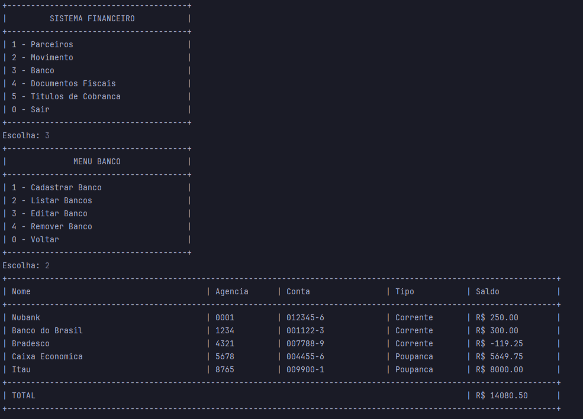

<div align="center">


</div>

## Sobre o Projeto

Este projeto foi desenvolvido como parte das disciplinas de Programação Orientada a Objetos e Banco de Dados, com o objetivo de integrar o conhecimento teórico e prático de ambas as áreas.

O projeto demonstra a aplicação de conceitos de POO, como encapsulamento, herança, polimorfismo e o uso de interfaces para padronizar toda a estrutura no sistema. A persistência dos dados foi gerenciada através de um banco de dados relacional, utilizando recursos avançados como Triggers, Views e Joins para otimizar o acesso e a manipulação dos dados.

---

## Técnologias usadas

<div align="center">

  

  
</div>

---



---

## Como usar

### Pré requisitos

1. Instalar [Java](https://www.oracle.com/java/technologies/downloads/)
2. Instalar [MySqlServer](https://dev.mysql.com/downloads/mysql/8.0.html)
3. Instalar [MySqlWorkbench](https://dev.mysql.com/downloads/workbench/)

### Criar o Banco de Dados

Dentro da pasta do projeto, você deve encontrar um arquivo `script.sql`. Este arquivo contém o script para criar as tabelas do banco de dados.

1. Abra o MySQL Workbench.
2. Conecte-se à sua instância local do MySQL usando a senha que você configurou.
3. Vá em File > Open SQL Script e selecione o arquivo SQL do projeto.
4. Execute o script. Isso criará o banco de dados e as tabelas necessárias.

### Configurando o Projeto

O projeto utiliza o MySQL Connector/J para se conectar ao banco de dados. Você precisa garantir que a dependência esteja no seu arquivo `pom.xml`.

```java
    <dependency>
            <groupId>com.mysql</groupId>
            <artifactId>mysql-connector-j</artifactId>
            <version>8.0.33</version>
    </dependency>
```

Se não tiver a seguinte dependencia acima, adicione-a entre as tags `<dependencies>` no arquivo

> Salve o arquivo e, se estiver usando uma IDE como IntelliJ ou Eclipse, ela deve resolver a dependência automaticamente. Se não, execute o comando `mvn install` no terminal dentro da pasta do projeto.

### Executando o Projeto

Após seguir todos os passos, você pode rodar o projeto.

Abra o projeto na sua IDE, verifique se a configuração de banco de dados no arquivo `Conexao` está correta (usuário, senha e nome do banco de dados) e execute a classe principal do projeto.

Se você tiver algum problema, verifique se todas as dependências foram baixadas corretamente e se a sua conexão com o banco de dados está funcionando.
